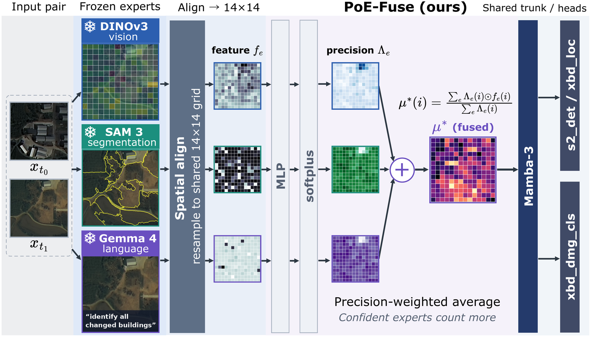

# PoE-Fuse

### Precision-Weighted Expert Fusion for Bi-Temporal Change Understanding

[](https://accv2026.org/)
[](https://www.python.org/)
[](https://docs.astral.sh/uv/)
[](https://github.com/Neurogica/PoE-Fuse/actions/workflows/ci.yml)
[](LICENSE)

**Compose frozen foundation experts instead of fine-tuning one.** PoE-Fuse resamples the features of a geometry, a grounding and a language expert onto one spatial grid, treats them as Gaussian observations of a latent scene state, and fuses them by learned per-cell precision. A single lightweight trunk then solves change detection, building localization and damage classification at once; the experts are never updated.

<p align="center">
  
</p>

<p align="center">
  <a href="#results">Results</a> ·
  <a href="#getting-started">Getting started</a> ·
  <a href="#usage">Usage</a> ·
  <a href="#citation">Citation</a>
</p>

<details>
<summary><strong>Abstract — click to expand</strong></summary>

Bi-temporal change understanding, which localizes and characterizes what changed between two satellite images, is central to disaster response and environmental monitoring, spanning change detection, building localization, and damage assessment. Strong vision-language models address these tasks, but adapting them typically requires full fine-tuning or reinforcement learning, which is costly and unstable. We propose PoE-Fuse, a parameter-efficient framework that instead composes frozen foundation experts for geometry, grounding, and language, resampling their features onto a shared spatial grid and training only a lightweight fusion trunk. PoE-Fuse treats the aligned features as Gaussian observations of a latent scene state and fuses them by learned per-cell precision. This product-of-experts estimator strictly generalizes uniform summation and scalar gating, and extends to change fields by composing the precisions of the two timestamps. A single shared trunk solves the three tasks at once, reaching a mean F1 of 59.2%, compared with 40.7% for an instruction-tuned temporal vision-language assistant, and surpassing dedicated change-detection models retrained under the same protocol and training budget.

</details>

## How it works

1. **Frozen experts.** DINOv3-SAT (geometry), SAM 3 (text-conditioned grounding) and Gemma 4 (language) encode each image of the co-registered pair. Their penultimate features are computed once and cached; nothing upstream is trained.
2. **Anchored alignment.** Only the geometric expert has a native spatial layout, so its 14×14 patch grid is the common frame. Learnable grid queries resample the order-free SAM 3 and Gemma 4 tokens onto that grid through cross-attention.
3. **Precision-weighted fusion.** Each aligned feature is modelled as a noisy Gaussian observation of a latent scene state with a learned per-cell, per-channel precision. The product of the experts' likelihoods has the precision-weighted average as its mean; a constant precision recovers uniform summation and a per-expert constant recovers scalar gating. For change fields the two timestamps' precisions compose harmonically, so one unreliable timestamp down-weights the whole difference.
4. **Shared trunk.** A four-block Mamba-3 mixer integrates the fused sequence and per-task heads read either the dense change field or the pooled features. About 60M parameters are trained on cached features, on one GPU.

## Results

Three tasks of the TEOChat benchmark under one pixel-F1 harness (S2Looking change detection, xBD building localization, xBD damage classification). Mean ± std over five seeds for PoE-Fuse and TEOChat and over three seeds for the specialists, which are retrained for 30 epochs to match the budget of our trunk. Specialists are trained separately per task; the generalists handle all three with one model.

| System | Mean ↑ | S2Looking det. ↑ | xBD loc. ↑ | xBD dmg. ↑ |
| :-- | --: | --: | --: | --: |
| *Specialist* | | | | |
| ChangeFormer | — | 37.7 ± 0.6 | 52.9 ± 1.9 | — |
| ChangeMamba | — | 38.6 ± 2.4 | 64.0 ± 1.3 | — |
| TinyCD | — | 46.6 ± 1.2 | 73.0 ± 2.0 | — |
| FC-Siam-Diff | — | 45.1 ± 1.7 | 72.2 ± 0.7 | 28.3 ± 1.2 |
| SNUNet | — | 44.1 ± 2.1 | 72.3 ± 1.2 | — |
| *Generalist* | | | | |
| TEOChat | 40.7 | 34.4 ± 0.4 | 38.0 ± 0.2 | 49.7 ± 0.2 |
| **PoE-Fuse (full system)** | **59.2** | **47.2 ± 1.3** | **75.4 ± 1.6** | **54.8 ± 3.5** |

<details>
<summary><strong>Fusion-rule ablation (Table 4 of the paper)</strong></summary>

The shared trunk is fixed and only the expert-combination rule changes; mean ± std over the same five seeds. Seed-paired two-sided *t*-tests on the mean against PoE-Fuse: uniform sum *p* = 0.047, static precision *p* = 0.015, scalar gate *p* = 0.37, no corollary *p* = 0.24, transformer mixer *p* = 0.82, softmax gate *p* = 0.23. The margin over scalar gating lies within seed noise; the system-level gain over the generalist baseline comes from the frozen-expert, shared-trunk design as a whole.

| Fusion rule | Precision Λ_e | S2Looking det. | xBD loc. | xBD dmg. | Mean |
| :-- | :-- | --: | --: | --: | --: |
| Uniform sum | Λ_e ≡ 1 | 46.0 ± 0.6 | 74.4 ± 1.3 | 50.8 ± 1.9 | 57.1 ± 1.1 |
| Scalar gate | Λ_e ≡ g_e | 47.2 ± 2.9 | 73.8 ± 2.1 | 53.3 ± 1.6 | 58.1 ± 1.1 |
| Static precision | input-independent | 46.9 ± 1.8 | 73.9 ± 0.5 | 51.3 ± 2.3 | 57.4 ± 0.8 |
| No corollary | PoE, single timestamp | 46.6 ± 2.2 | 74.5 ± 2.2 | 53.5 ± 2.3 | 58.2 ± 1.5 |
| Transformer mixer | PoE + self-attention | 48.8 ± 2.9 | 76.5 ± 2.1 | 51.6 ± 4.1 | 59.0 ± 1.0 |
| Concatenation | concat + linear | 45.8 ± 3.7 | 70.4 ± 2.6 | 49.2 ± 2.7 | 55.1 ± 2.5 |
| Cross-attention | — | 46.1 ± 1.7 | 70.5 ± 1.8 | 40.2 ± 13.5 | 52.3 ± 5.2 |
| Softmax gate | per cell / channel | 46.1 ± 3.2 | 73.5 ± 2.3 | 52.5 ± 2.0 | 57.4 ± 1.5 |
| **PoE-Fuse** | full per-cell dynamic | 47.2 ± 1.3 | 75.4 ± 1.6 | **54.8 ± 3.5** | **59.2 ± 1.2** |

</details>

Every ablation arm in the paper (fusion rule, coupling site, expert subset) is a config under `configs/ablation/`. Training only the trunk is about 118× fewer trained parameters than instruction-tuning the 7B baseline; at inference every frozen expert still runs, so the efficiency concerns adaptation, not deployment.

## Getting started

Requires Python 3.10 or newer, [uv](https://docs.astral.sh/uv/getting-started/installation/) and an NVIDIA GPU with the CUDA toolkit: `mamba-ssm` builds CUDA extensions at install time.

```bash
uv venv --python 3.12 && source .venv/bin/activate
uv pip install -e .               # train / evaluate on cached features
uv pip install -e ".[features]"   # + extract features from raw imagery
```

Extracting features needs the three frozen encoders. All three are gated on the Hugging Face Hub (Meta and Google license approval); after access is granted and `HF_TOKEN` is set, `scripts/download_backbones.py` places them under `models/`:

```bash
export HF_TOKEN=hf_...
uv run scripts/download_backbones.py --which dinov3 sam3 gemma
```

DINOv3 and SAM 3 install from their upstream repositories (not PyPI); the SAM 3 package additionally requires `pycocotools`. Gemma 4 loads through `transformers`.

## Usage

The trunk trains on cached, frozen expert features, so the flow is: cache once, then train and evaluate. The task configs under `configs/` name the TEOChatlas JSON records and image roots (defaults under `/data/TEOChatlas`; see `poe_fuse/data.py`).

```bash
# 1. Cache frozen features per task (writes feature_cache/<task>/{train,eval})
python scripts/cache_features.py --config configs/s2_seg_head_poe.yaml      --out-dir feature_cache/s2_det
python scripts/cache_features.py --config configs/xbd_loc_seg_head_poe.yaml --out-dir feature_cache/xbd_loc
python scripts/cache_features.py --config configs/xbd_dmg_cls_head_poe_focal.yaml --out-dir feature_cache/xbd_dmg_cls

# 2. Train the shared trunk on the three tasks (paper setting: 30 epochs, seeds 42/123/456/789/999)
python scripts/train_multitask.py --tasks-file configs/tasks_3_poe_focal.txt \
    --epochs 30 --seed 42 --out results.json --ckpt checkpoint.pt

# 3. Evaluate a checkpoint
python scripts/eval_multitask.py --tasks-file configs/tasks_3_poe_focal.txt --checkpoint checkpoint.pt

# 4. Specialist change-detection baselines, trained from scratch under the same budget
python scripts/cd_baselines.py --task s2_det --arch tinycd --seed 0
```

A tasks file lists `key:config:cache_dir` triples, one task per line. `train_multitask.py` also accepts `--grad-clip`, `--early-stop-patience`, `--resume` and `--eval-only`; `cd_baselines.py --arch` covers `fc_siam_diff`, `unet`, `snunet`, `tinycd`, `changeformer` and `changemamba`.

### Ablations

`configs/ablation/` holds one tasks file per arm, runnable with the same command:

```bash
python scripts/train_multitask.py --tasks-file configs/ablation/tasks_uniform.txt --epochs 30 --seed 42
```

Fusion rules: `tasks_uniform`, `tasks_gate`, `tasks_poe_static`, `tasks_poe_nocorollary`, `tasks_poe_xfmr`. Coupling sites: `tasks_poe_dense_only`, `tasks_poe_cls_only`. Expert subsets: `tasks_expert_{dino,sam3,gemma,dino_sam3,dino_gemma,sam3_gemma}`. The precision form is set by the `FusionConfig` fields `poe_fuse`, `poe_static`, `poe_diff_corollary`, `poe_dense` and `poe_cls`, and the active experts by `FusionConfig.active_experts`.

## Development

```bash
uv pip install -e ".[dev]"
ruff check .
```

CI runs the lint on every push; the package itself needs CUDA to build, so tests are run locally on a GPU machine.

## Repository contents

```text
poe_fuse/          model package: config, codec (feature extraction), fusion (precision-weighted PoE),
                   mamba3 / mixers, heads, model, data, feature_cache, train (training + evaluation library)
poe_fuse/metrics/  pixel-F1 and classification metrics (TEOChat harness conventions)
scripts/           entry points: cache_features, train_multitask, eval_multitask, cd_baselines, download_backbones
configs/           task configs, the three-task files, and configs/ablation/ (13 arms)
assets/            method figure and teaser from the paper
```

Reproducing the paper's tables additionally requires the TEOChatlas data and the three gated backbones; neither is included here.

## Citation

```bibtex
@inproceedings{watase2026poefuse,
  title     = {{PoE-Fuse}: Precision-Weighted Expert Fusion for Bi-Temporal Change Understanding},
  author    = {Haruki Watase and Shunya Nagashima and Takayuki Nishimura},
  booktitle = {Proceedings of the Asian Conference on Computer Vision (ACCV)},
  year      = {2026}
}
```

[CITATION.cff](CITATION.cff) separately describes the software.

## License

[BSD-3-Clause](LICENSE). The frozen backbones (DINOv3, SAM 3, Gemma 4), the TEOChatlas benchmark and dependencies remain subject to their respective licenses and terms.
